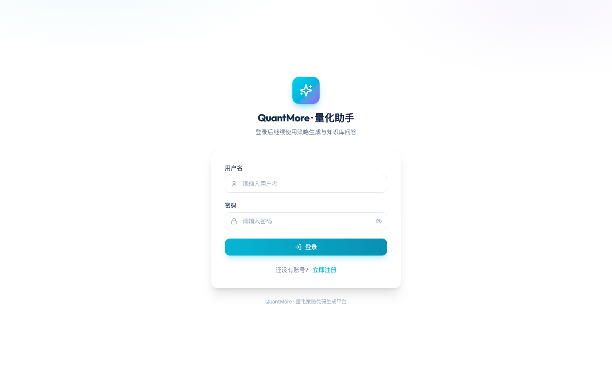
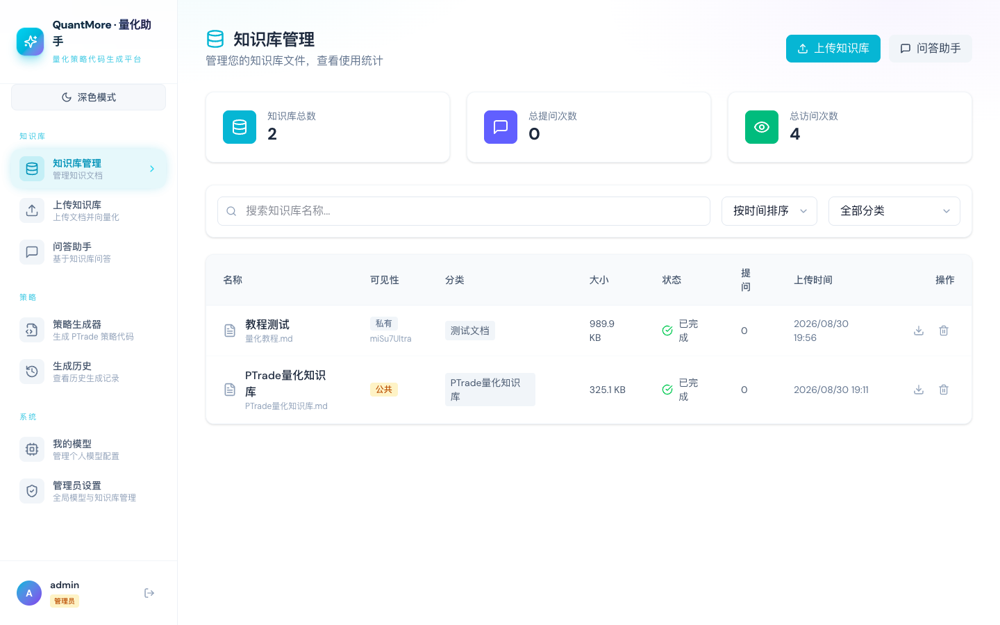
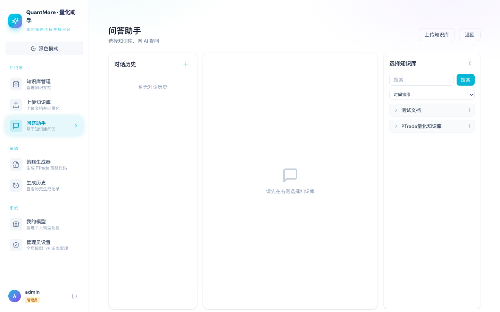
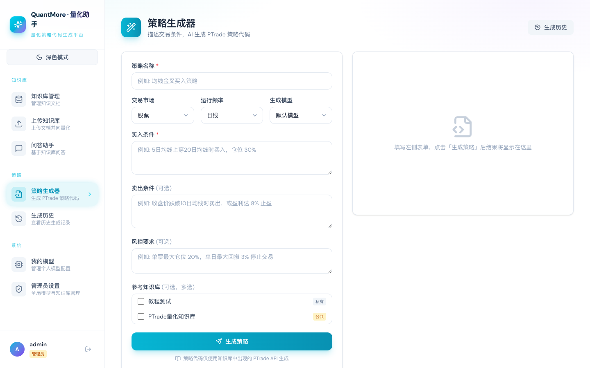

# QuantMore · 量化策略代码生成平台

输入自然语言，产出可运行的量化策略代码（PTrade）。基于知识库做检索增强生成（RAG），支持多用户、多模型。

## 界面截图

| 登录 | 知识库管理 |
|---|---|
|  |  |

| 问答助手 | 策略生成器 |
|---|---|
|  |  |

## 功能

- **知识库 + 问答**：知识库来自本地文档目录（启动时自动按子目录切割导入，亦可页面上传），向量化后以对话方式提问，回答严格依据知识库内容，代码使用文档中出现过的 API，不臆造
- **策略生成器**：表单填写策略需求（名称/市场/频率/买卖条件/风控）→ 检索知识库示例 → 生成完整可运行的 `.py` 策略文件（可复制/下载，带历史记录）
- **多用户**：开放注册，首个注册用户自动成为管理员；每人独立的对话记录与模型 API Key
- **多模型**：预置通义千问(qwen) / DeepSeek / Kimi(Moonshot) / 智谱 GLM，支持自定义 OpenAI 兼容端点；API Key 用 AES-GCM 加密存储

## 技术栈

Spring Boot 4.1 / Java 25 / Spring AI 2.0 / PostgreSQL 16 + pgvector / Redis 7 + Redisson Streams / MinIO / React 18 + TypeScript + Vite + Tailwind 4

## 本地运行

前置：JDK 25、Node 18+、pnpm 10+、Docker

```bash
# 1. 配置
cp .env.example .env
# 编辑 .env：设置 APP_AI_CONFIG_ENCRYPTION_KEY、APP_JWT_SECRET（已随机生成可直接用）、
#           AI_BAILIAN_API_KEY（通义千问/embedding）、各 PROVIDER_*_API_KEY（可选）

# 2. 启动依赖（PostgreSQL 5433 / Redis 6380 / MinIO 9002，避开常用端口）
docker compose -f docker-compose.dev.yml up -d

# 3. 启动后端
./gradlew :app:bootRun          # http://localhost:8080，Swagger: /swagger-ui.html

# 4. 启动前端
cd frontend && pnpm install && pnpm dev   # http://localhost:5173
```

### 知识库导入（自动）

`.env` 中 `APP_SEED_KB_DIR` 指向本地文档目录（默认 `/Users/pengpai/Desktop/ptrade-qmt-docs-scraper/docs`）。每次启动后端自动执行种子导入：

- **按子目录切割**：每个顶层子目录 = 一个知识库单元（目录内 md 合并），根目录 md 文件各自成库（跳过 `assets/`）
- **幂等**：按内容哈希去重，重复启动不会重复导入
- **自愈**：已存在但向量化失败的单元会自动重新向量化（配好 API Key 后重启即可恢复）

## 生产部署

单机 Docker Compose 一键部署：生产编排 `docker-compose.yml` 已内置 fail-fast 密钥校验、健康检查与日志轮转，仅暴露 80 端口。完整手册（服务器初始化、密钥生成、首次部署两阶段、备份恢复、故障排查、schema 变更规范）见 [docs/production-deployment.md](docs/production-deployment.md)。

```bash
cp .env.example .env    # 按「必需配置」段与末尾「生产部署」段生成并填入全部密钥
docker compose up -d --build
```

## 使用流程

1. 注册第一个账号（自动成为管理员）→ 设置页配置**全局 Embedding 服务**（DashScope `text-embedding-v3` 或智谱 `embedding-3`，维度必须 1024）与全局内置 Provider Key
2. 启动后端自动导入知识库并向量化；若导入时 Key 未配好，配好后重启自动重新向量化
3. 在「我的模型」配置自己的 API Key（或用全局内置 Key），选择默认模型
4. 在「问答助手」创建会话、选择知识库、用自然语言提问
5. 在「策略生成器」填表生成完整策略文件

## 关键设计

- **全局 Embedding**：所有向量化（公共+私有知识库）统一使用管理员配置的 embedding 服务；pgvector 列固定 1024 维，切换服务需全量重新向量化
- **模型解析优先级**：用户配置行（有 Key 且启用）> 全局内置行 > 用户默认模型 > 全局默认模型
- **API Key 安全**：AES-GCM 加密落库，密钥来自 `APP_AI_CONFIG_ENCRYPTION_KEY`；密码 BCrypt；JWT HS256 无状态鉴权
- **异步向量化**：Redis Stream 生产者/消费者，失败自动重试 3 次，状态可轮询

## 测试

```bash
./gradlew :app:test --no-daemon     # 后端（需本机 Redis 于 6379，限流集成测试用）
cd frontend && pnpm run build       # 前端
```

## 许可证

AGPL-3.0
